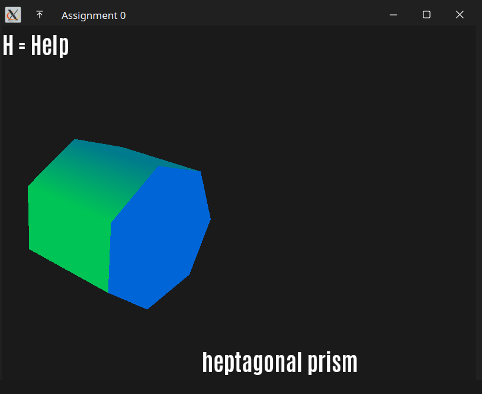

## Computer Graphics Assignment 0

# $n$-gonal prism and pyramid visualizer

`
Soham Korade
2021101131
`

## Features
- rotation of the prism and pyramid
- change the number of sides
- auto-rotate
- help screen
- smooth animated transition from prism to pyramid and vice-versa

## Contents
- `libraries`: glfw, glad and glm built from source
- `include`: shader class from learnopengl.com and stb_image.h
- `src`: source files
- `textures`: textures used in the project
- `shaders`: shaders used in the project
- `fonts`: fonts used in the project
- `CMakeLists.txt`: cmake file
- `README.md`: this file

## Requirements
- CMake
- OpenGL
- FreeType

<b>NOTE:</b> The following libraries should exist in the <u>libraries</u> folder.
- GLFW
- GLAD
- GLM

## Compiling and running
`cmake . && make && ./app`
